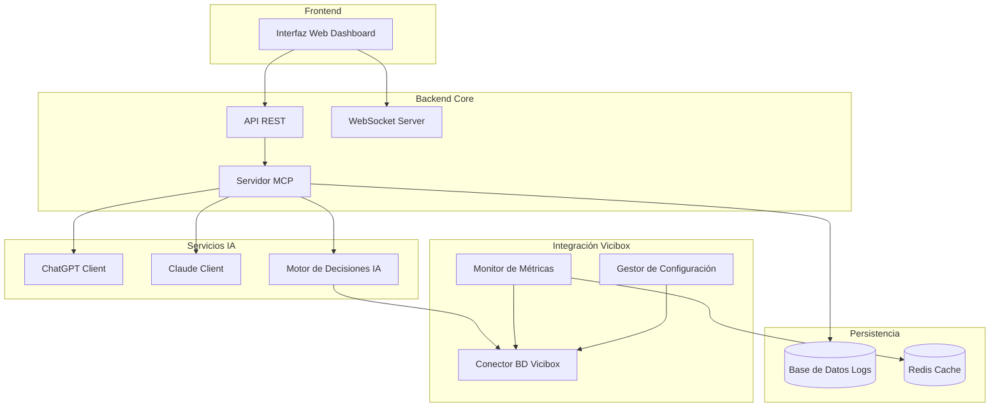
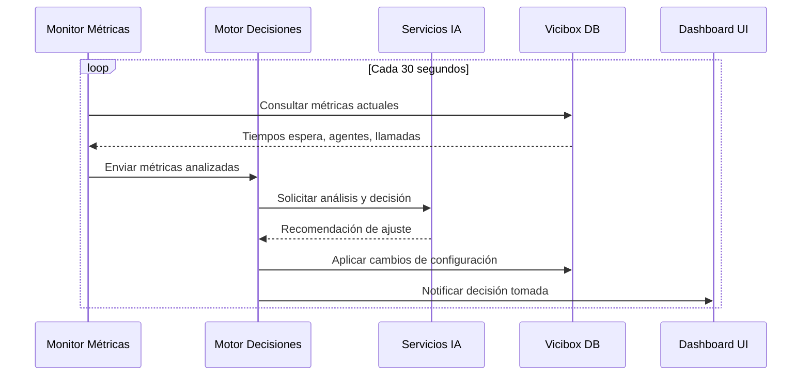

# Documento de Diseño

## Visión General

El sistema de integración MCP-Vicibox es una aplicación de automatización inteligente que utiliza el protocolo MCP (Model Context Protocol) para conectar múltiples servicios de IA con la base de datos de Vicibox. El sistema monitorea continuamente las métricas operativas del call center y toma decisiones automáticas para optimizar parámetros como la cantidad de llamadas simultáneas, reduciendo los tiempos de espera de los usuarios finales.

## Arquitectura

### Arquitectura General



### Flujo de Decisión Automática



## Componentes y Interfaces

### 1. Servidor MCP Core

**Responsabilidades:**
- Gestionar conexiones con servicios de IA
- Implementar el protocolo MCP estándar
- Coordinar el flujo de datos entre componentes
- Manejar autenticación y autorización

**Interfaces:**
```typescript
interface MCPServer {
  initialize(): Promise<void>
  connectAIService(service: AIServiceConfig): Promise<Connection>
  processRequest(request: MCPRequest): Promise<MCPResponse>
  shutdown(): Promise<void>
}

interface AIServiceConfig {
  name: string
  apiKey: string
  endpoint: string
  model: string
  maxTokens: number
}
```

### 2. Monitor de Métricas

**Responsabilidades:**
- Conectar con la base de datos de Vicibox
- Recopilar métricas en tiempo real
- Detectar anomalías y tendencias
- Cachear datos para optimizar rendimiento

**Interfaces:**
```typescript
interface MetricsMonitor {
  getCallMetrics(): Promise<CallMetrics>
  getAgentMetrics(): Promise<AgentMetrics>
  getQueueMetrics(): Promise<QueueMetrics>
  detectAnomalies(metrics: Metrics): AnomalyReport[]
}

interface CallMetrics {
  totalCalls: number
  activeCalls: number
  averageWaitTime: number
  maxWaitTime: number
  callsInQueue: number
}
```

### 3. Motor de Decisiones IA

**Responsabilidades:**
- Analizar métricas usando IA
- Generar recomendaciones de ajuste
- Aplicar límites de seguridad
- Registrar decisiones y resultados

**Interfaces:**
```typescript
interface DecisionEngine {
  analyzeMetrics(metrics: Metrics): Promise<Decision>
  applyDecision(decision: Decision): Promise<ApplyResult>
  validateDecision(decision: Decision): ValidationResult
  rollbackDecision(decisionId: string): Promise<void>
}

interface Decision {
  id: string
  timestamp: Date
  action: 'increase_calls' | 'decrease_calls' | 'no_change'
  currentValue: number
  recommendedValue: number
  confidence: number
  reasoning: string
}
```

### 4. Conector Vicibox

**Responsabilidades:**
- Establecer conexión segura con BD Vicibox
- Ejecutar consultas de métricas
- Aplicar cambios de configuración
- Manejar transacciones y rollbacks

**Interfaces:**
```typescript
interface ViciboxConnector {
  connect(): Promise<Connection>
  queryMetrics(query: MetricsQuery): Promise<QueryResult>
  updateConfiguration(config: ConfigUpdate): Promise<UpdateResult>
  testConnection(): Promise<boolean>
}
```

## Modelos de Datos

### Métricas del Sistema

```typescript
interface SystemMetrics {
  timestamp: Date
  callMetrics: {
    totalActive: number
    inQueue: number
    averageWaitTime: number
    maxWaitTime: number
  }
  agentMetrics: {
    totalAgents: number
    availableAgents: number
    busyAgents: number
    utilization: number
  }
  systemMetrics: {
    cpuUsage: number
    memoryUsage: number
    dbConnections: number
  }
}
```

### Configuración del Sistema

```typescript
interface SystemConfiguration {
  callLimits: {
    minSimultaneousCalls: number
    maxSimultaneousCalls: number
    currentSimultaneousCalls: number
  }
  thresholds: {
    maxWaitTimeSeconds: number
    minAgentUtilization: number
    maxAgentUtilization: number
  }
  aiSettings: {
    decisionInterval: number
    confidenceThreshold: number
    enableAutoAdjustment: boolean
  }
}
```

### Registro de Decisiones

```typescript
interface DecisionLog {
  id: string
  timestamp: Date
  triggerMetrics: SystemMetrics
  decision: Decision
  appliedChanges: ConfigUpdate[]
  resultMetrics?: SystemMetrics
  success: boolean
  error?: string
}
```

## Manejo de Errores

### Estrategia de Recuperación

1. **Fallos de Conexión IA:**
   - Retry automático con backoff exponencial
   - Fallback a servicio IA alternativo
   - Modo degradado con reglas predefinidas

2. **Fallos de BD Vicibox:**
   - Mantener última configuración válida
   - Alertas inmediatas al administrador
   - Logs detallados para diagnóstico

3. **Decisiones Erróneas:**
   - Sistema de rollback automático
   - Límites de seguridad estrictos
   - Validación antes de aplicar cambios

### Códigos de Error

```typescript
enum ErrorCodes {
  AI_SERVICE_UNAVAILABLE = 'AI_001',
  VICIBOX_CONNECTION_FAILED = 'VB_001',
  INVALID_DECISION = 'DEC_001',
  CONFIGURATION_ERROR = 'CFG_001',
  AUTHENTICATION_FAILED = 'AUTH_001'
}
```

## Estrategia de Testing

### Testing Unitario
- Componentes individuales con mocks
- Validación de lógica de decisiones
- Testing de conectores de BD

### Testing de Integración
- Flujo completo de decisión automática
- Integración con servicios IA reales
- Testing de rollback y recuperación

### Testing de Carga
- Simulación de alta carga de llamadas
- Rendimiento bajo estrés
- Estabilidad de conexiones

### Testing de Seguridad
- Validación de autenticación
- Testing de inyección SQL
- Verificación de encriptación

## Consideraciones de Seguridad

### Autenticación y Autorización
- JWT tokens para API REST
- API keys seguras para servicios IA
- Credenciales encriptadas para Vicibox

### Protección de Datos
- Encriptación TLS para todas las comunicaciones
- Logs sin información sensible
- Rotación automática de credenciales

### Límites de Seguridad
- Rangos máximos/mínimos para ajustes automáticos
- Validación de decisiones antes de aplicar
- Sistema de aprobación para cambios críticos

## Configuración y Despliegue

### Variables de Entorno

```bash
# Servicios IA
OPENAI_API_KEY=sk-...
ANTHROPIC_API_KEY=sk-ant-...

# Base de Datos Vicibox
VICIBOX_DB_HOST=localhost
VICIBOX_DB_PORT=3306
VICIBOX_DB_USER=vicibox_user
VICIBOX_DB_PASSWORD=secure_password
VICIBOX_DB_NAME=asterisk

# Configuración MCP
MCP_SERVER_PORT=3000
MCP_LOG_LEVEL=info
MCP_DECISION_INTERVAL=30

# Redis Cache
REDIS_URL=redis://localhost:6379

# Seguridad
JWT_SECRET=your-secret-key
ENCRYPTION_KEY=your-encryption-key
```

### Estructura de Directorios

```
vicibox-mcp-integration/
├── src/
│   ├── server/           # Servidor MCP core
│   ├── ai/              # Clientes servicios IA
│   ├── vicibox/         # Integración Vicibox
│   ├── decision/        # Motor de decisiones
│   ├── metrics/         # Monitor métricas
│   ├── api/             # API REST
│   └── ui/              # Interfaz web
├── config/              # Archivos configuración
├── logs/                # Archivos de log
├── tests/               # Tests automatizados
└── docs/                # Documentación
```